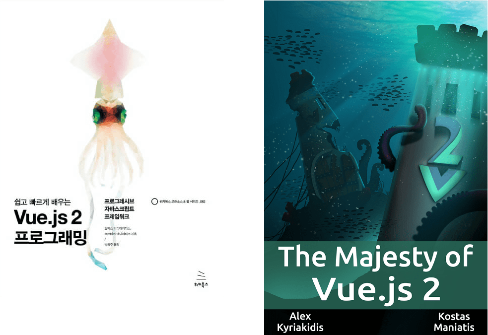
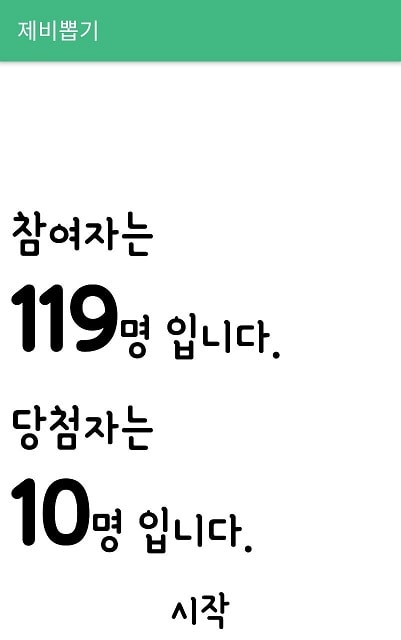
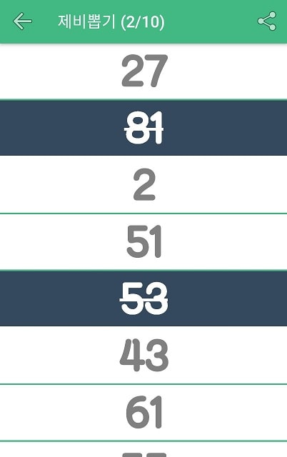

# NativeScript로 제비뽑기 앱을 만들어 본 이야기

저는 네이티브 안드로이드 앱을 만들어 본적이 없습니다. 네이티브 모바일 앱을 만들 이유도 없었고 크게 관심을 가지고 있지도 않습니다. **[React Native](https://facebook.github.io/react-native/)**라는게 있다고 해서 간단하게 Master-Detail 기반으로 예제를 만들어 테스트 정도만 해본 것이 전부입니다.

Vue를 다루면서 Vue로 모바일 앱을 만들 수 있다는 **[Weex](https://weex.incubator.apache.org/)**를 보고 이제는 모바일 앱을 만들어 볼 수 있겠다! 라는 막연한 기대감을 가지고 있었습니다. 이전에 Cordova는 몇번 사용해봤지만 그냥 HTML, CSS, JavaScript로 할 수 있구나 정도로만 알고 있습니다.


최근 **NativeScript**를 알게 되었고 Vue를 지원하려는 움직임이 있다는 소식을 듣고 더 관심이 갔습니다. Vue.js 한국어 사용자 모임에 공유한 [1분만에 Vue.js와 NativeScript](https://vuejs-kr.github.io/vue/nativescript/2017/08/11/introduce-vue-nativescript-02/)와 [Vue와 NativeScript로 네이티브 모바일 앱 만들기](https://vuejs-kr.github.io/vue/nativescript/2017/08/11/introduce-vue-nativescript-01/)를 읽어보시면 현재 어느정도까지 지원되는지 확인하실 수 있습니다.

Vue.js 한국어 사용자 모임 미트업 (Vuetiful Korea) 2회 모임을 앞두고 오신 분들께 작은 선물을 드려야겠다고 생각했습니다. 문제는 어떻게 드려야 좋을지 고민하다가 제비뽑기 앱을 만들기로 했습니다. 겸사 겸사 NativeScript도 사용을 해서요.



예정된 선물입니다 :)

## NativeScript Core 프로젝트 환경

NativeScript는 3가지 프로젝트 환경을 제공합니다

- NativeScript + JavaScript
- NativeScript + TypeScript
- NativeScript + Angular & TypeScript
- ...그리고 NativeScript + Vue.js 는 개발중입니다.

저는 TypeScript 기초밖에 모르고,  Angular는 더더욱 잘 모르는 상태라 순수 JavaScript를 사용하기로 했습니다. 이 결정은 TypeScript를 공부해야겠다고 마음먹는데 결정적인 역할을 합니다 :)

## NativeScript 개발 환경 (특히 NativeScript Sidekick)

NativeScript는 NativeScript Sidekick이라는 좋은 프로젝트 관리 도구를 제공합니다. NativeScript Sidekick을 사용한 이후로 터미널을 켜서 작업한 시간이 엄청나게 줄었습니다. 이 도구에서 거의 대부분의 작업이 가능합니다. Sidekick이라고 이름을 지은게 납득이 됩니다.

NativeScript Sidekick이 제공하는 목록입니다. 

- 프로젝트 만들기 (+ 프로젝트 언어 환경과 기본 템플릿까지)
- 앱 기본 설정 (이름, 설명, 버전 등)
- iOS, Android 각 환경에 한정된 설정
- 아이콘, 로딩스플래시 이미지 설정
- npm 기반의 플러그인 관리
- 디버그/릴리즈 빌드 (로컬환경 뿐만아니라 클라우드 환경으로 빌드가 가능합니다)
- 개발 중 실시간 변경을 반영하는 라이브 싱크 모드
- 화면의 엘리먼트 트리를 보여주는 크롬 기반 개발자 도구
- 다양한 기준으로 나뉜 로그 뷰어

모바일 개발 환경 설정이 매우 까다로웠지만 일단 설정만 잘 되면 그 후로는 NativeScript Sidekick를 사용해서 스트레스가 적습니다. 

```
tns doctor
```

위 명령어는 NativeScript 개발 환경이 정상적인지 진단합니다. 모든 준비가 나올 때까지 시간이 조금 걸렸습니다. 준비가 안되면 Sidekick에서 사용할 수 없다고 계속 거부합니다.

## 제비뽑기 앱의 목적

이번에 만든 제비뽑기 앱의 목적은 참여자 수와 당첨자 수를 입력 받고 참여자 번호를 섞어서 차례대로 선물을 드리는 것입니다.

UI는 매우 화려하게 하고 싶었지만 처음 사용하는데 욕심을 조금 덜 부려서 2페이지만 만들기로 했습니다. 한 페이지는 참여자 수와 당첨자 수를 받는 화면이고, 다른 한 페이지는 당첨자를 순서대로 리스트로 출력하는 화면입니다.

아래와 같은 앱입니다





## 제비뽑기 앱의 구현 목표

첫번째 페이지는 참여자 수와 당첨자 수를 나타내는 영역을 탭하면 프롬프트를 보여주고 입력된 숫자를 화면에 보여줍니다.
최초 참여자와 당첨자 수는 매번 앱이 실행될 때마다 변경됩니다. 몇분이나 행사에 오실지 몰라서 기본 값을 랜덤으로 설정해놨습니다.

두번째 페이지는 당첨자 수를 참여자 수 기준으로 무작위로 섞어서 순서대로 보여줍니다. 무작위로 섞는 것은 공정함을 위해 [lodash에서 쓰는 Fisher-Yates Shuffle](https://github.com/lodash/lodash/blob/master/shuffle.js)을 구현해서 사용했습니다. 각 리스트 아이템은 탭하면 당첨되었다는 표시를 토글합니다. 그리고 모두 당첨자 수만큼 선택되면 더 이상 선택이 안됩니다. 그리고 당첨 현황은 공유를 위해 참여자 수와 당첨자 번호 목록을 문자 또는 각종 앱에 공유할 수 있도록 했습니다.

## 제비뽑기 앱의 구현 중 느낀 점들

아래 내용들은 극히 개인적인 경험을 기반으로 합니다. 제비뽑기 앱을 만들면서 겪었던 한정적인 경험입니다.
내용에 오류가 있는 경우에는 알려주세요. 읽고 계신 분들께서 다른 앱을 만들어 보시면서 경험을 공유해주시면 잘 배우겠습니다.

### UI작업이 생각보다 어렵지 않다.

너무나 간단한 앱이라 UI라고 할만한 것이 없지만 Layout 종류와 사용방법을 익히고 현재 UI를 만드는데 긴 시간이 걸리지 않았습니다. 대충 인라인으로 스타일을 주고 LiveSync로 확인한 뒤 확정되면 CSS 파일로 옮기면 끝이었습니다. 마지막에 머티리얼 디자인의 리플 효과도 쉽게 추가되었습니다. 웹 레이아웃 작성하듯, Vue에서 컴포넌트 작업하는 느낌이 많이 들었습니다.

### Vue.js 개발자는 적응하기 쉽다

Vue는 단일 파일 컴포넌트를 사용하는 것이 큰 장점인데 NativeScript를 사용하면서 느낀 점은 단일 파일 컴포넌트라는 것을 조금 뒤로 두고 순수 JavaScript 환경에서 Vue 개발하는 것과 유사한 느낌을 줍니다

XML이 Vue의 **template** 역할을 하고 View를 관리하는 JavaScript는 Vue의 라이프사이클과 메소드를 쓰는 느낌을 주었습니다. 화면 전환, 페이지 로드 등의 시점에 해야할 일들을 처리할 곳이 명확했습니다. 그리고 ViewModel을 담당하는 스크립트는 Vue의 Data 역할을 합니다. 템플릿에 바인딩된 속성이 `Observable` 모듈을 기반으로 하고 있으면 ViewModel의 속성이 변경되면 템플릿에 자동으로 반영됩니다. 따로 어떠한 영역의 화면을 아이디로 가져와서 값을 직접 넣어주어야 하는 수고가 없습니다


### 순수 JavaScript로 처리하기에는 헷갈린다

일반 웹 개발을 하다가 NativeScript로 개발을 하면 원래 알던 JavaScrpt 기본 타입에 NativeScript에서만 사용되는 타입들이 추가되어 메소드에 전달된 파라미터가 어떤 타입인지 알기 힘듭니다. 일일히 문서를 보아야해서 문제가 발생했을 때 한참 다시 찾아봤습니다. VSCode는 TypeScript를 잘 지원하기 때문에 NativeScript 확장과 함께 사용하면 전달된 파라미터의 타입때문에 고생할 일이 적을 것으로 생각합니다.

### NativeScript 문서는 잘 되어 있다

NatveScript의 문서는 난이도와 카테고리 별로 잘 나뉘어져 있습니다. 기본적인 튜토리얼을 읽고나서 아키텍처, 라이프사이클, 데이터 바인딩 등을 읽어보면 어느정도 어떻게 돌아가겠구나 싶었습니다. 그리고 실제 개발할 때 막히는 부분이 있을 때마다 다시 보면 설명이 이미 다 되어있었습니다.
특히 이번에는 UI 작업을 할 때 기초/컴포넌트/레이아웃 등 필요한 부분마다 설명을 보면 사용할 수 있어서 좋았습니다.

실제로 사용하지는 못한 부분 중에서도 꽤나 자세하게 설명된 부분들이 있습니다.

- 이미 있는 네이티브 앱에 통합하기
- 백엔드와의 통신
- 웹팩을 이용해 최초 실행 시간 줄이기
- 유닛 테스팅
- 플러그인 만들기

이 밖에도 많은 내용들이 있습니다

### 쓸만한 플러그인들이 은근히 있다

이번에 사용한 플러그인 목록입니다.

- 로딩 화면
- 리플 효과 
- 공유하기
- RadListView 

[NativeScrpt Plugnis](http://plugins.nativescript.org/)에 500여개의 플러그인이 있습니다. 너무 많아서 다 보지는 못했습니다. 위에 사용한 플러그인 외에 SQLite를 위해 nativescript-sqlite를 테스트해봤는데 문제 없이 잘 작동하였습니다. RadListView는 기본 ListView를 확장한 리스트뷰인데 스와이프 등을 지원해서 써봤습니다. 실제 앱을 만들면서 스와이프는 안쓰기로 해서 제외했습니다. 더보기 기능의 문구를 수동으로 지정하면 화면을 못그리는 버그가 있어서 영어로 놔둔 것을 빼면 만족스럽게 사용했습니다.

## 더 해야할 일

아직 아이콘도 없고 스플래시 이미지도 안만들어서 플레이스토어에 출시는 못했습니다. 출시까지 하면서 NativeScript로 앱을 만들고 출시도 가능한 것을 확인할 생각입니다.
그리고 리플효과 플러그인과 RadListView를 동시에 쓰면 원래 사용하는 메소드를 조금 변형해서 사용해야 하는데 이 부분도 기본 ListView를 확장하면서 수정할 계획입니다.

## 소스코드

모든 소스코드는 [Github](https://github.com/ChangJoo-Park/DrawTheLots)에 공개되어 있습니다. 
 
## 마무리

실제 코드가 내용에 하나도 없지만 NativeScript로 어떤걸 했는지 전달해드리고 싶었습니다. 나중에 Vue.js가 잘 지원된다면 더 편하게 개발할 수 있을거라 생각합니다. 이 글의 내용은 정리해서 개인적으로 준비하는 **Up and Running** 에서 하나씩 다룰 생각입니다. 그리고 다른 분들의 사용기도 듣고 싶습니다. Vue도 마이너하다고 느꼈는데 꽤 유명해진 것을 보면 NativeScript도 혹시? 하는 기대를 하고 있습니다.


