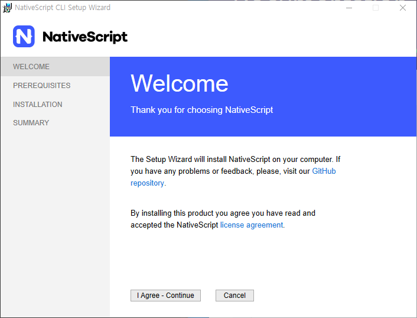
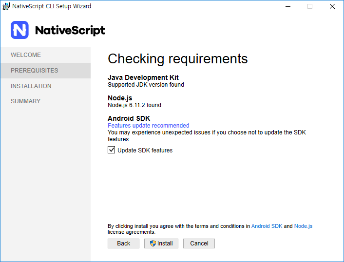
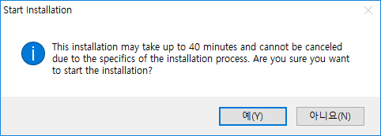

--- 
:: NativeScript 설치

:: Node.js 설치

```bash
# https://nodejs.org/en/
```

:: NativeScript CLI 설치


:::: Windows

Windows의 경우 NativeScript에서 제공하는 설치 프로그램을 이용합니다.

[다운로드](https://www.nativescript.org/docs/default-source/default-document-library/nativescript-cli-setup-wix.exe)



NativeScript 스크립트 CLI는 최소 **Windows 7 서비스팩 1** 이상 설치 되어있는 시스템이 필요합니다. 최소 사양을 못맞추면 설치할 수 없습니다.




NativeScript CLI 설치 도구는 **JDK**, **Node.js**, **Android SDK**를 설치합니다. 



약 40분 정도 설치 시간이 소요됩니다.


:::: Mac, Linux

맥과 리눅스는 npm 을 통해 NativeScript CLI를 설치합니다. Node.js 가 설치 되어 있어야 합니다.

```bash
$ npm install -g nativescript
```

설치가 완료되면 다음 명령어로 설치결과를 확인합니다

```bash
$ tns
┌─────────┬───────────────────────────────────────────────────────────────────┐
│ Usage   │ Synopsis                                                            │
│ General │ $ tns <Command> [Command Parameters] [--command <Options>]          │
│ Alias   │ $ nativescript <Command> [Command Parameters] [--command <Options>] │
└─────────┴───────────────────────────────────────────────────────────────────┘
```

