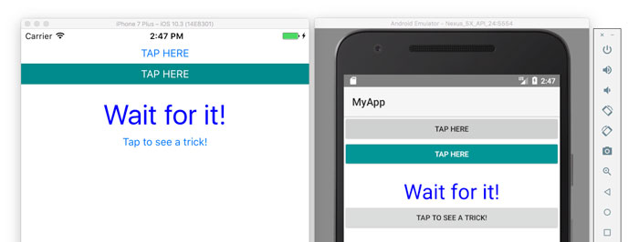
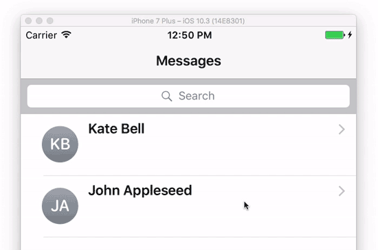
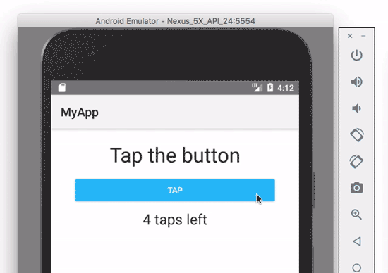
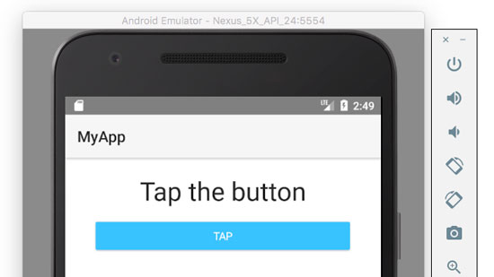

# Vue와 NativeScript를 이용해 네이티브 iOS와 Android 앱 만들기


> TJ VanToll 작성<span style="color: rgb(51, 51, 51); font-family: Roboto, sans-serif; font-size: 15px; font-style: normal; font-variant-ligatures: normal; font-variant-caps: normal; font-weight: normal; letter-spacing: 0.26px; orphans: 2; text-align: start; text-indent: 0px; text-transform: none; white-space: normal; widows: 2; word-spacing: 0px; -webkit-text-stroke-width: 0px; background-color: rgb(255, 255, 255); text-decoration-style: initial; text-decoration-color: initial; display: inline !important; float: none;">eScript C</span>  July 17, 2017

[Vue](https://vuejs.org/)는 애플리케이션의 View 레이어를 처리하는데 사용하는 인기있는 JavaScript 프레임워크입니다. NativeScript는 개발자가 JavaScript를 사용해 완전한 네이티브 iOS, Android 애플리케이션을 만들 수 있게 합니다. 두 기술을 이용하면 Vue의 간결함과 NativeScript의 성능을 가진 모바일 앱을 만들 수 있습니다.

NativeScript 커뮤니티는 [이를 가능케 하는데 열심히 노력했으며](https://www.nativescript.org/blog/a-new-vue-for-nativescript) 지난 몇 개월 동안 상당한 성과가 있었습니다. 통합되는 것은 아직 초기이며 프로덕션 레벨의 앱을 위한 준비가 되어있지는 않으나 만든 것을 실험하고 구현된 것을 볼 준비는 되어 있습니다.

이 글에서는 Vue와 NativeScript를 사용해 간단한 앱을 만드는 방법을 배우고 몇가지 예제를 통해 어떻게 작동하는지 확인할 수 있습니다. 시작해보겠습니다.

> **참고**:  이 글을 따라하려면 NativeScript 및 필요한 모듈을 컴퓨터에 설치해야합니다. 아직 NativeScript를 설치하지 않았다면 [NativeScript 설치 가이드](http://docs.nativescript.org/start/quick-setup)를 읽어보세요.

## 앱 시작하기

NativeScript는 NativeScript CLI를 사용해 앱을 만들고, 빌드하며, 배포합니다. NativeScript를 프레임워크 없이 사용(NativeScript Core)하거나 Angular또는 Vue와 같은 프레임워크를 사용하는 여부와 상관없이 필요합니다. 따라서 이미 설치된 NativeScript 환경이 있다면 Vue를 시작하기 위해 알아야할 것들이 많습니다. NativeScript를 시작하기 위한 몇가지 명령어가 있습니다.

첫째로, `tns create` 입니다. 이 명령어는 새 NativeScript 앱을 만드는데 사용합니다. `create` 명령어는 사전에 정의된 많은 템플릿 중 하나를 사용할 수 있도록 `--template` 옵션을 제공합니다. Vue를 사용하는 새 NativeScript 앱을 시작하려면 터미널이나 명령 프롬프트에서 다음 명령어를 입력하세요

```bash
tns create MyApp --template nativescript-vue-template
```

이 명령어는 새 NativeScript 앱에 필요한 파일들을 스캐폴딩하기 떄문에 완료하는데 약간의 시간이 걸립니다. 초기화가 완료되면 새로운 `MyApp` 폴더로  `cd` 명령어를 이용해 이동하세요.

```bash
cd MyApp
```

다음으로 `tns run` 명령어를 사용하여 iOS 또는 Android용 앱을 만듭니다.

```bash
tns run ios
```

또는

```bash
tns run android
```

> **참고**: 앱을 실행하는 중 오류가 발생하면 NativeScript의 의존성 목록이 설치되지 않았을 것 입니다. [NativeScript 설치 가이드](http://docs.nativescript.org/start/quick-setup)는 해결하는데 도움이 될 것입니다. 그리고 [NativeScript 커뮤니티 포럼](https://discourse.nativescript.org/)에도 자유롭게 질문해주세요.


그리고 NativeScript 및 Vue로 구동하는 완전한 네이티브 iOS 또는 Android 앱이 실행되었을 것입니다. 기본 앱은 아래처럼 표시될 것입니다.

<!-- Image -->



어떻게 작동하는지에 대한 자세한 내용을 걱정하지 않아도 됩니다. 이 앱을 엄청나게 간단하게 바꾸어 모든 기능이 어떻게 작동하는지 살펴볼 것입니다. 그러려면 `app/app.js` 파일을 열어 아래 전체를 아래 내용으로 변경하세요.

```js
const Vue = require("nativescript-vue");

new Vue({
  template: `
    <Page>
      <StackLayout>
        <Label text="Hello Vue user "></Label>
      </StackLayout>
    </Page>
  `
}).$start();
```

`app.js` 파일을 저장하면 NativeScript CLI가 변경을 감지하여 자동으로 앱을 새로고침합니다. 이제 아래와 같은 화면이 되어야합니다.

<!-- Image -->


이제 시작점에 다다랐으니 코드를 하나씩 파헤쳐보겠습니다.

## 어떻게 작동하는지 살펴봅니다

VUe 개발자라면 앞의 코드 중 일부는 익숙할 것입니다. 하지만 약간 새로운 부분도 있습니다.

이해를 돕기 위해 이전 예제가 일반적인 "hello world" Vue 웹앱과 어떻게 다른지 살펴보겠습니다. [이 예제는 웹에서 완전히 동일하게 작동됩니다](https://jsfiddle.net/50wL7mdz/43777/).


```js
<script src="vue.js"></script>

<div id="app"></div>

<script>
  new Vue({
    el: "#app",
    template: `
      <div>
        <label>Hello Vue </label>
      </div>
    `
  })
</script>
```

이 예제에서 Vue의 JavaScript 코드를 `<script>` 태그로 가져오고 `Vue()` 생성자를 호출하여 새 앱을 초기화합니다. Vue는 앱의 `<div>`와 `<label>`을 가진 템플릿을 가져와서 해당 마크업을 DOM (여기서는 `<div="app">` 엘리먼트)에 렌더링합니다.

이 코드는 간단하고 쉽습니다. 이러한 단순함이 사람들이 Vue를 좋아하는 이유 중 하나일 것입니다. 이제 Vue 웹 앱의 작동 방식을 알게 되었으므로 NativeScript 코드를 보겠습니다.

```js
const Vue = require("nativescript-vue");

new Vue({
  template: `
    <Page>
      <StackLayout>
        <Label text="Hello Vue user "></Label>
      </StackLayout>
    </Page>
  `
}).$start();
```

코드가 비슷하지만 매우 큰 차이가 있습니다. 위에서부터 살펴봅니다.

```js
const Vue = require("nativescript-vue");
```

이 코드는 웹의 `<script>`와 동일하며 NativeScript 컨텍스트에서 `Vue` 생성자를 가져오는 방법입니다.

NativeScript는 CommonJS 스펙을 구현합니다. 이 스펙은 이전에 노드 환경에서 개발해본 경험이 있다면 알고 있을 것 입니다. CommonJS에 익숙하지 않은 경우 간단하기 때문에 걱정하지 않아도 됩니다. CommonJS 모듈을 `require()` 함수를 사용하여 다른 모듈에서 JavaScript 함수를 가져오고 `export` 및 `exports` 키워드를 사용하여 다른 모듈이 가져올 자체 API를 노출합니다. 이 경우 "nativescript-vue" 플러그인은 `Vue` 생성자를 내보내고, `require()` 함수를 사용해 `app.js` 파일에 있는 참조를 가져옵니다.

`require()`를 이용해 얻은 `Vue` 생성자를 얻었으면 생성자를 호출하여 앱을 초기화 해야합니다. 웹의 초기화 코드는 다음과 같습니다.

```js
new Vue({
  el: "#app",
  template: `
    <div>
      <label>Hello Vue </label>
    </div>
  `
});
```

그리고 NativeScript의 초기화 코드입니다.

```js
new Vue({
  template: `
    <Page>
      <StackLayout>
        <Label text="Hello Vue user "></Label>
      </StackLayout>
    </Page>
  `
});
```

가장 먼저 주목할 점은 NativeScript에는 `el` 속성이 없는 것 입니다. 웹에서는 Vue를 사용할 때 Vue가 CSS 셀렉터를 `el` 속성으로 웹앱의 특정 부분만 제어합니다.


NativeScript의 컨텍스트에는 이 옵션이 없습니다. - 기본적으로 Vue는 네이티브 iOS와 Android 앱 전체를 제어하기 떄문에 `el` 속성이 필요하지 않습니다.

`Vue` 생성자가 Vue 웹앱과 NativeScript 앱에서 작동하는 방식을 살펴보았으므로 NativeScript 템플릿이 어떻게 작동하는지 보겠습니다.

## 템플릿 작업하기

이 예제의 `template` 속성은 웹 앱에서 Vue를 사용하고 NativeScript 앱에서 Vue를 사용하는 것과 가장 큰차이를 보이는 부분입니다. 이해를 돕기 위해 Vue 웹 예제를 먼저 보겠습니다.

```js
<div>
  <label>Hello Vue </label>
</div>
```

그리고 NativeScript의 템플릿입니다.

```js
<Page>
  <StackLayout>
    <Label text="Hello Vue user "></Label>
  </StackLayout>
</Page>
```

이 코드를 이해하기 위한 열쇠는 NativeScript 앱에는 브라우저가 없음을 이해하는 것입니다. 따라서 `<div>` 및 `<span>`과 같은 브라우저의 태그는 네이티브 iOS 및 Android에 해당하는 태그가 없어 작동하지 않습니다. NativeScript를 사용하려하면 문법 오류를 냅니다.

대신, NativeScript는 네이티브 iOS 및 Android 컨트롤들을 추상화한 [일련의 유저 인터페이스 컴포넌트](https://docs.nativescript.org/ui/components)를 제공합니다. 예를 들어, 위의 코드에서 볼 수 있는 `<Label>`은 브라우저에서 레이블을 렌더링하지 않습니다.  이는 실제로 iOS에서  [UILabel](https://developer.apple.com/library/ios/documentation/UIKit/Reference/UILabel_Class/)를, Android에서 [android.widget.TextView](http://developer.android.com/reference/android/widget/TextView.html)를 렌더링합니다.


NativeScript의 멋진 점은 세부 사항이 개발자에게 완전히 투명하다는 점입니다. Android Studio에서 Android 앱을 만드는 것과 Xcode에서 iOS 앱을 만드는 것과 동등합니다. 하지만 JavaScript, Vue 및 몇가지 새로운 유저 인터페이스 컨트롤을 사용합니다.

이러한 새로운 유저 인터페이스 컨트롤은 웹 배경에서 NativeScript를 시작하고 실행하는데 약간의 러닝커브가 있음을 의미합니다. NativeScript를 성공적으로 사용하려면 NativeScript의 UI 컴포넌트가 무엇이며 어떻게 작동하는지 알아야합니다. 예제 코드에서 살펴봅니다.

```js
<Page>
  <StackLayout>
    <Label text="Hello Vue user "></Label>
  </StackLayout>
</Page>
```

맨 위의 `<Page>` 컴포넌트 부터 시작합니다. 페이지는 네이티브 모바일 앱의 기본적인 컴포넌트입니다. 네이티브 앱에서는 인터페이스의 일부를 페이지로 지정해야합니다. iOS와 Android는 모두 이 동작에 대한 규칙이 내장되어있어 두 페이지간 전환이 가능합니다. 예를 들어 Android에는 네비게이션에 사용할 수 있는 하드웨어 뒤로가기 버튼이 있으며 iOS는 익숙한 오른쪽으로 스와이프하는 기능이 있습니다.

<!-- iOS Transition  -->


NativeScript 앱에서는 `<Page>` UI 컴포넌트를 사용하여 앱에서 이러한 고유 페이지를 표시하고 이동할수 있습니다.


> **참고**: 페이지 라우팅은 NativeScript Vue 플러그인에서 아직 지원되지 않습니다.  [이 이슈](https://github.com/rigor789/nativescript-vue/issues/11)를 살펴보세요. 페이지 네비게이션 개발에 도움을 주려면 Github 또는 [Slack의 #vue 채널로 오세요](http://developer.telerik.com/wp-login.php?action=slack-invitation)

템플릿의 코드 뭉치를 살펴보겠습니다.

```js
<StackLayout>
  <Label text="Hello Vue user "></Label>
</StackLayout>
```

NativeScript는 브라우저를 사용하지 않기 때문에 `display:block`과 `display:inline` 과 같은 웹에서 사용하는 개념이 없습니다. 대신 NativeScript는 화면에 앱 컴포넌트를 정렬하기 위해 사용하는 [레이아웃 UI 컨트롤](https://docs.nativescript.org/ui/layout-containers)을 제공합니다.

레이아웃 중 가장 쉬운 것은 [<StackLayout>](https://docs.nativescript.org/ui/layout-containers#stacklayout)입니다. 컴포넌트를 화면 위로(수직이 기본입니다 수평으로 만드려면 `orientation="horizontal"` 속성을 추가하세요) 쌓아 올립니다. 다른 인기있는 레이아웃 컴포넌트는 [<GridLayout>](https://docs.nativescript.org/ui/layout-containers#gridlayout)입니다. 이 레이아웃을 사용하면 화면을 행과 열 집합으로 나눌 수 있습니다. 그리고  `<FlexboxLayout>` 컴포넌트를 사용하면 웹에서 사용했던 것과 동일한 flexbox 문법을 사용해 엘리먼트를 정렬할 수 있습니다.

간단한 앱의 경우 하나의 `<StackLayout>`는 하위 엘리먼트를 페이지 상단부터 쌓기 시작합니다. 따라서 앱의 상태 표시줄 바로 아래에 간단한 레이블이 표시됩니다.

<!-- Hello Vue -->


이 기본 예제에 대한 이야기를 마치기 전에 마지막으로 다루어야 할 것이 있습니다. NativeScript Vue 앱이 사용하는 `$start()` 메소드입니다.

```js
new Vue({
  template: `...`
}).$start();
```

`$start()` 메소드는 NativeScript Vue 플러그인이 NativeScript와 Vue 전용으로 특별히 추가한 메소드 입니다. 왜일까요?


NativeScript는 프레임워크가 적절한 iOS 및 Android API를 호출할 수 있도록 [application.start() 메소드](https://docs.nativescript.org/core-concepts/application-lifecycle#start-application)를 호출해야합니다. Vue 플러그인이 제공하는 `$start()` 메소드는 Vue 인스턴스를 인스턴스화 하여 새로운 iOS와 Android 앱을 실행합니다.

간단한 Vue 및 NativeScript의 시작점을 살펴보았습니다. 짧지는 않았지만 작은 코드에서 얻은 것들을 잊지 말아야합니다. 간단한 기능을 갖춘 네이티브 iOS 및 Android 앱을 만들 수 있었습니다. 여러가지 새로운 개발환경을 살펴보았고, JavaScript, Vue 및 적은 양의 NativeScript를 사용해보았습니다.

이 예제를 계속 이용해 약간의 기능을 추가해 보겠습니다.

## 작은 기능을 하는 예제 만들기

NativeScript 앱을 만들어본 경험이 있다면 NativeScript 탭 챌린지를 알 것입니다. 탭 챌린지는 임의의 횟수만큼 버튼을 눌러 메시지를 보여주는 작고 우스운 앱입니다. 데이터 바인딩, 유용한 이벤트와 스타일링을 쉽게 살펴볼 수 있기 때문에 2년이 넘는 동안 기본 NativeScript 예제로 사용되고 있습니다.

<!-- Tap the Button -->



이 섹션에서는 Vue와 NativeScript가 어떻게 통합되는지 자세히 알아보기 위해 Vue를 사용해 간단한 탭 챌린지를 만듭니다. 첫째로, `app.js` 파일의 코드를 아래 코드로 바꾸세요. 그러면 새로운 유저 인터페이스 컴포넌트가 추가될 것입니다.

```js
const Vue = require("nativescript-vue");

new Vue({
  template: `
    <Page>
      <StackLayout class="p-20">
        <Label text="Tap the button" class="h1 text-center"></Label>
        <Button text="TAP" class="btn btn-primary btn-active"></Button>
      </StackLayout>
    </Page>
  `
}).$start();
```

이 코드는 앞의 예제와 많이 닮았지만 이번에는 컴포넌트가 모두 `class` 속성을 갖습니다. 보시다시피 class 속성은 컴포넌트의 외향에 영향을 줍니다.

<!-- Styled App -->


어떻게 이렇게 되나요? NativeScript가 HTML 또는 DOM 엘리먼트를 사용하지 않지만 프레임워크에서 [CSS의 서브셋을 사용하는 앱 스타일 지정](https://docs.nativescript.org/ui/styling)을 사용해 UI 컴포넌트를 꾸밀 수 있습니다. NativeScript는 네이티브 iOS 및 Android UI 컴포넌트를 사용하므로 특정 CSS 속성에만 앱 스타일을 지정할 수 있습니다. [NativeScript 문서의 전체 속성 목록](https://docs.nativescript.org/ui/styling#supported-css-properties)을 읽어보세요. 자주 사용하는 속성인 `margin`, `padding`, `color`, `background-color` 등이 모두 작동합니다.

NativeScript는 또한 [Bootstrap과 유사한 테마](https://docs.nativescript.org/ui/theme)가 포함되어 있습니다. 위의 코드 처럼 사용법이 정확히 같습니다. `<Label>`의 `h1` 클래스 이름은 웹에서 컨트롤을 `<h1>` 처럼 보이게 하고 `btn`, `btn-primary`, `btn-active` 클래스 이름은 네이티브 iOS와 Android 버튼을 꾸미는데 도움을 줍니다.

필요한 경우 NativeScript 문서의 [styling](https://docs.nativescript.org/ui/styling) 또는 [theming](https://docs.nativescript.org/ui/theme)를 살펴보세요. 이 모든 것이 어떻게 작동하는지 더 자세하게 알 수 있을 것입니다. 

이제부터는 데이터 바인딩이 어떻게 작동하는지 살펴봄으로써 이 예제를 완성시켜나가겠습니다.

## NativeScript와 Vue의 데이터 바인딩

웹에서 데이터 바인딩은 DOM 객체의 속성을 JavaScript 객체의 속성에 바인딩하여 작동합니다. NativeScript에 DOM은 없지만 Vue가 웹에서 사용하는 문법과 완전히 똑같은 문법을 사용하여 데이터를 네이티브 iOS 및 Android 유저 인터페이스 컨트롤에 바인딩할 수 있습니다.

예제에 컴포넌트를 한개 더 추가하면 어떻게 작동하는지 알 수 있습니다. `app.js` 파일의 내용을 아래 코드로 변경합니다. 그러면 새로운 `<Label>`과 일부 데이터 바인딩이 추가되어 텍스트를 설정합니다.

```js
const Vue = require("nativescript-vue");

new Vue({
  data: {
    counter: 42
  },

  template: `
    <Page>
      <StackLayout class="p-20">
        <Label text="Tap the button" class="h1 text-center"></Label>
        <Button text="TAP" class="btn btn-primary btn-active"></Button>
        <Label :text="message" class="h2 text-center" textWrap="true"></Label>
      </StackLayout>
    </Page>
  `,

  computed: {
    message: function() {
      return this.counter + " taps left";
    }
  }
}).$start();
```

위 코드에서 일어나는 일들을 살펴보겠습니다. 먼저 `Vue` 인스턴스에 포함한 `data` 속성을 봅니다.

```js
data: {
  counter: 42
}
```

`data` 객체는 Vue 앱의 유저 인터페이스에서 바인딩해야하는 모든 속성을 정의하는 곳 입니다. 사용자의 탭 수를 추적하기 위해 `counter` 속성을 정의했습니다. (사용자는 탭 챌린지를 완료하기 위해 버튼을 임의 횟수만큼 눌러야하는 것을 기억하세요)

Vue는 [데이터를 바인딩하는 여러가지 방법](https://vuejs.org/v2/guide/index.html#Handling-User-Input)을 제공합니다. 이 예제의 경우에는 레이블의 `text` 속성 (`:text`)에 콜론을 사용해 해당 text 속성을 JavaScript 코드의 `message` 속성에 바인딩합니다.

`message` 속성은 어디에서 왔을까요? 실제로 Vue의 또 다른 기능인 [계산된 속성](https://vuejs.org/v2/guide/computed.html)을 사용하여 동적으로 속성 값을 적용할 수 있습니다. 이 경우 `counter`를 포함하는 메시지를 작성할 수 있습니다.

```js
<Label :text="message" class="h2 text-center" textWrap="true"></Label>
```

```js
computed: {
  message: function() {
    return this.counter + " taps left";
  }
}
```

이 코드로 앱이 Vue를 불러올 때 먼저 템플릿의 `:text="message"` 구문을 해석합니다. 사용할 값을 결정하기 위해 Vue는 `computed` 객체에서 `message` 속성의 함수를 호출하고 반환한 문자열을 표시합니다. 이제 다음 앱이 만들어졌습니다.

<!-- Tap the button -->


이 예제에 약간의 로직을 추가하고 끝내기 전에 얼마나 멋진 코드인지 살펴볼 필요가 있습니다. 위에서 본 `42 taps left` 레이블이 `<label>`이 아닌  iOS에서는 `UILabel`이고 Android에서는 `android.widget.TextView`임을 기억하세요. 또한 웹용 앱을 빌드하는데 사용하는 것과 동일한 Vue 문법을 사용하여 완전히 고유한 컨트롤에 바인딩 할 수 있습니다. 

이제 앱을 작동시키기 위한 마지막 단계는 버튼을 탭하면 `counter` 속성을 감소시키는 약간의 코드를 추가하는 것 입니다. 이를 구현하고 예제를 완성하려면 아래 코드를 `app.js`에 붙여넣으세요.

```js
const Vue = require("nativescript-vue");

new Vue({
  data: {
    counter: 42
  },

  template: `
    <Page>
      <StackLayout class="p-20">
        <Label text="Tap the button" class="h1 text-center"></Label>
        <Button text="TAP" @tap="onTap" class="btn btn-primary btn-active"></Button>
        <Label :text="message" class="h2 text-center" textWrap="true"></Label>
      </StackLayout>
    </Page>
  `,

  computed: {
    message: function() {
      if (this.counter <= 0) {
        return "Hoorraaay! You unlocked the NativeScript clicker achievement ";
      } else {
        return this.counter + " taps left";
      }
    }
  },

  methods: {
    onTap() {
      this.counter--;
    }
  }
}).$start();
```

위의 코드에는 두가지 새로운 것이 있습니다. 첫번째는 앱의 버튼에 있는 `@tap="onTap"` 속성입니다. 이벤트 바인딩을 처리하기 위한 Vue의 문법입니다. NativeScript는 사용자가 유저 인터페이스 컨트롤을 탭하면 탭 이벤트를 발생시킵니다. `@tap="methodName"` 구문은 해당 이벤트를 바인딩하는 방법입니다. (같은 Vue 문법을 이용해 네이티브 iOS 및 Android 이벤트에 바인딩하는 것이 멋지지 않나요?)

두번째 새로운 코드는 `onTap` 핸들러 입니다. 이 핸들러는 앱의 카운터를 감소시키는 간단한 함수입니다.

```js
onTap() {
  this.counter--;
}
```

그리고 이제 30여 줄의 코드에서 완벽한 탭 챌린지 구현이 가능해졌습니다.

<!-- Tap Challenge (1) -->
.gif)

## 그 밖에 무엇을 할 수 있나요?

탭 챌린지는 세상에서 가장 복잡한 앱은 아닙니다 하지만 방금 만든 내용을 간략하게 살펴보는 것이 중요합니다. JavaScript와 Vue로 만든 네이티브 기능을 갖춘 iOS와 Android 앱을 만들었습니다.

NativeScript와 Vue의 통합은 여전히 초기 단계에 있는 커뮤니티에 기반한 성장을 하고 있지만 이 점이 멋진 것들을 만들 수 없다는 것은 아닙니다. 시작하려면 `app-with-list-view.js``, app-with-router.js``, app-with-tab-view.js`, 그리고 `app-with-vmodel.js`을 살펴보세요. 각 파일을 `app.js` 파일에 복사하고 붙여넣어 다양한 형태의 Vue 앱을 만들 수 있는 완벽한 코드들입니다.

두가지 참고할만한 내용입니다. 하나는 NativeScript의 Vue 지원은 초기 단계이나 NativeScript 자체는 JavaSciprt를 사용하여 iOS 및 Android 애플리케이션을 만들 수 있는 배포 가능한 앱 프레임워크입니다. NativeScript로 할 수 있는 것들을 더 배우고 싶다면 [NativeScript 시작하기](https://docs.nativescript.org/#get-started)를 읽어보세요. 두번째는 Vue + NativeScript 개발에 도움을 주려면 [Slack의 #vue 채널로 오세요](http://developer.telerik.com/wp-login.php?action=slack-invitation). 피드백 및 의견은 언제나 환영합니다 😄