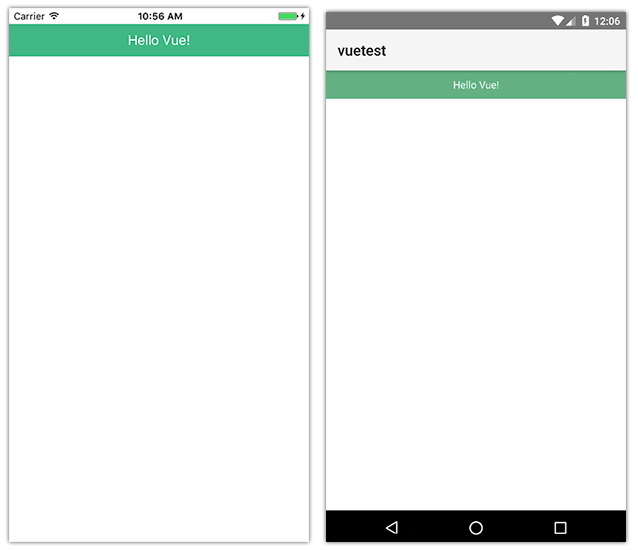

# 1분만에 Vue.js와 NativeScript 앱 만들기


프레임워크 자체가 확장할 수 있다는 것은 NativeScript의 핵심 중 하나입니다. [Angular](https://angular.io/), 커뮤니티에서 개발되고 있는 [Vue](https://vuejs.org/), 빠르게 진행되는 [Preact 지원](https://github.com/staydecent/nativescript-preact) 그리고 "바닐라" JavaScript (NativeScript 코어)에 대한 지속적인 지원 의지가 있기 때문에 NativeScript는 기본적으로 요구하는 JavaScript 프레임워크가.

초기에 NativeScript의 이름이 "Angular Native"였던 것을 알고 있나요? Angular에 빠져있는 동안 하나의 특정한 프레임워크에 우리 스스로를 가두고 싶지 않았습니다. 때문에 [Vue와 NativeScript](http://developer.telerik.com/products/nativescript/native-ios-android-vue-nativescript/)을 통합하려는 시도에 흥분한 이유입니다.


몇 주 전에 Vue를 사용하여 NativeScript 앱을 개발할 때 짧은 비디오를 만들었습니다. 아직 못보셨으면 한번 보세요.

[TJ VanToll](https://twitter.com/tjvantoll)의 멋진 글인 [Vue와 NativeScript를 이용해 네이티브 iOS와 Android 앱 만들기](https://developer.telerik.com/products/nativescript/native-ios-android-vue-nativescript/)도 읽어보세요

<div style="position:relative;height:0;padding-bottom:75.0%"><iframe src="https://www.youtube.com/embed/jnRmXczcSdQ?ecver=2" width="480" height="360" frameborder="0" style="position:absolute;width:100%;height:100%;left:0" allowfullscreen></iframe></div>

**스스로 해보고 싶으신가요?** 이제부터 Vue와 NativeScript를 이용해 밑바닥부터 만들어 봅니다.

## Vue와 NativeScript 사용하기

아직 NativeScript가 설치되지 않으셨나요? 물론 이미 설치하셨겠지요. 아니라면  [읽어보세요](https://docs.nativescript.org/)

```bash
npm install -g nativescript
```

다음으로 NativeScript 프로젝트를 만듭니다.

```bash
tns create vue-test (or whatever you want to call your app)
```

방금 만든 디렉터리로 이동합니다.

```bash
cd vue-test
```

[nativescript-vue plugin](https://www.npmjs.com/package/nativescript-vue)을 설치합니다.

```bash
npm install --save nativescript-vue
```

`app.js` 파일을 열고 기존 내용을 아래의 코드로 바꿉니다.

```js
const Vue = require('nativescript-vue/dist/index');

new Vue({
  template: `
    <page>
      <stack-layout>
        <label text="Hello Vue!" style="background-color:#41b883;color:#ffffff;padding:10;text-align:center"></label>
      </stack-layout>
    </page>
  `,
}).$start();
```

더 진행하기 전에 이 코드가 무슨일을 하는지 살펴보겠습니다.

- nativescript-vue 모듈을 가져옵니다.
- 새로운 Vue 템플릿에 NativeScript의 레이아웃과 UI 컴포넌트를 정의했습니다.
- `$start()`를 호출합니다. NativeScript의 `application.start()` 메소드가 더 익숙할 수 있습니다.

마지막으로 연결된 iOS/Android 기기 또는 에뮬레이터에서 앱을 실행합니다.

```bash
tns run ios | android
```

끝입니다!

<!-- Image -->


## 다음은 무엇을 해야할까요?

1.0 버전 릴리즈를 향해 나아가는 동안 [nativescript-vue plugin](https://www.npmjs.com/package/nativescript-vue)를 가지고 놀아보세요. NativeScript 레이아웃과 UI 컴포넌트를 모두 사용해보세요. [열려있는 이슈를 확인하고](https://github.com/rigor789/nativescript-vue/issues) 🐛를 없애주세요!

